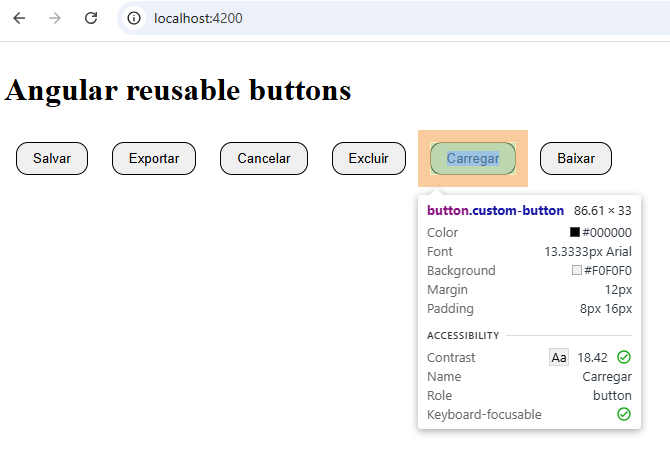
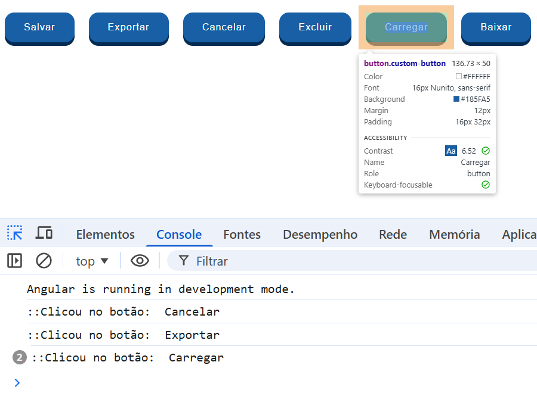
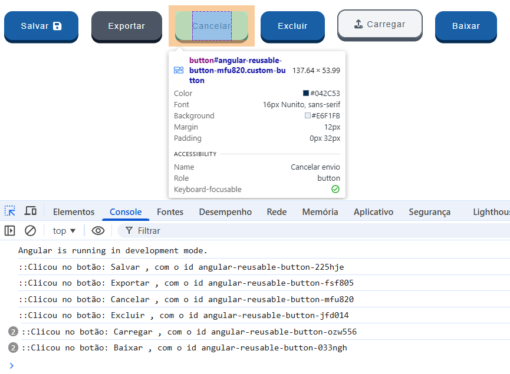
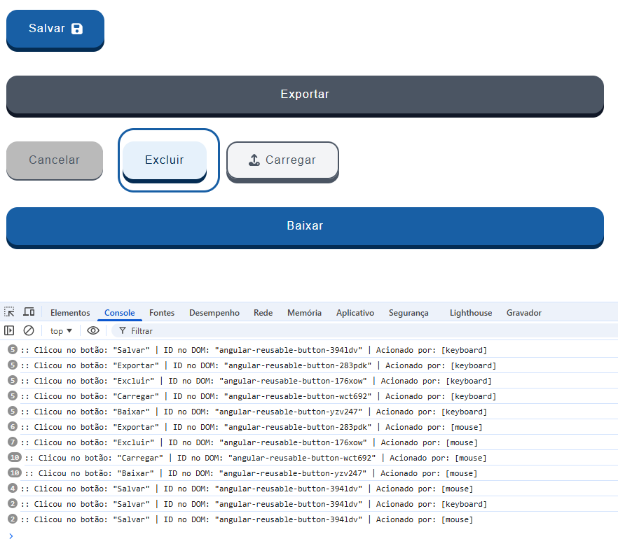
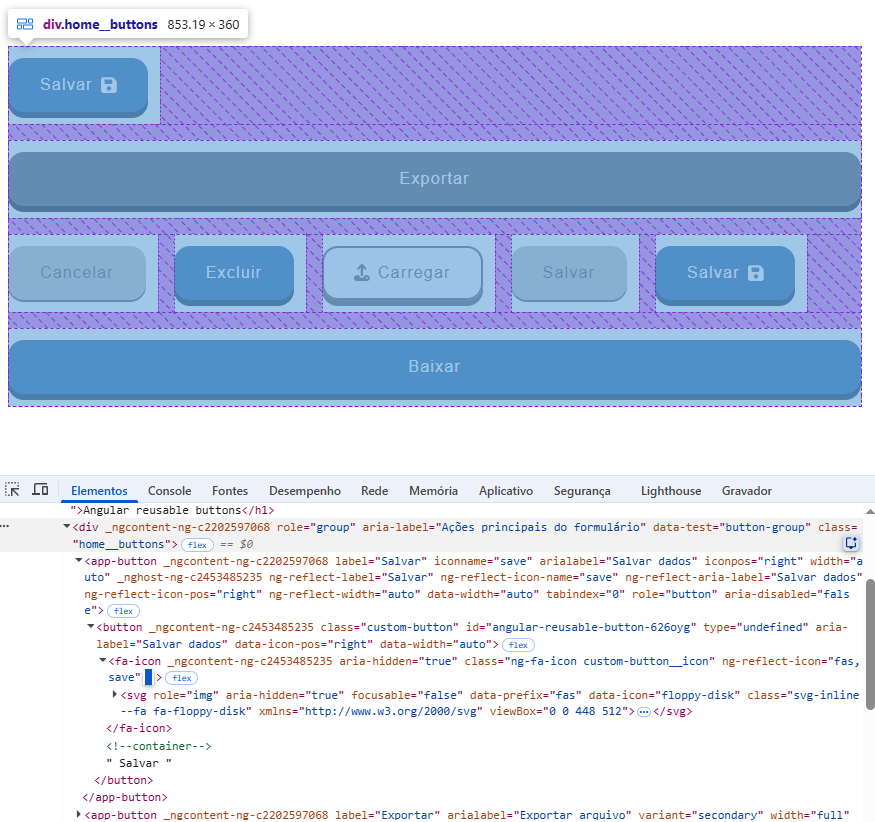
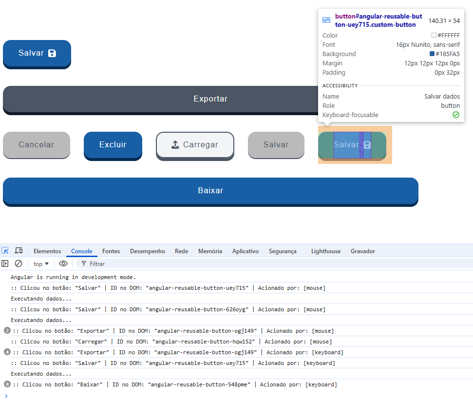

# Angular Reusable Button

Esse projeto foi desenvolvido utilizando a versão moderna do **Angular 18+ (Componentes Standalone)** e **SCSS**.
O objetivo central desta aplicação não é apenas exibir um botão na tela, mas sim demonstrar na prática os benefícios arquiteturais que a criação de **Componentes Reutilizáveis** traz para a escalabilidade do desenvolvimento frontend, seguindo padrões de **Clean Code**, **SOLID** e **Design System**.

### 📋 Pré-Requisitos
- Node.js 18
- Angular CLI 18.2.19

### O que foi praticado neste projeto

- Criação de botão reutilizável no Angular
- Uso de @Input e @Output
- Tipagem forte com TypeScript
- Boas práticas de acessibilidade
- Customização via propriedades
- Separação de responsabilidades
- Estilização com SCSS


## 🚀 Como rodar a aplicação

1. **Clone o repositório:**
  ```bash
    git clone https://github.com/cidaluna/angular-reusable-button.git
  ```

2. **Navegue até o diretório do projeto**
```bash
  cd angular-reusable-button
```

3. **Instale as dependências do projeto**
  ```bash 
    npm install
  ```

4. **Inicie a aplicação Angular**
  ```bash 
    ng serve
  ```

5. **Abra o seu navegador e acesse a aplicação em:**
  ```text
   http://localhost:4200/
   ```

### 🔑 Geração Dinâmica de IDs Criptográficos (Client-Side)
Em aplicações corporativas de grande porte, atribuir IDs sequenciais estáticos (`1`, `2`, `3`) em componentes compartilhados gera colisões graves no DOM, quebrando ferramentas de leitores de tela (**WCAG**) e invalidando testes automatizados (**Cypress / Playwright**).

Para solucionar este problema de forma 100% isolada e sem dependência de banco de dados, implementamos um gerador de sufixos alfanuméricos na inicialização do componente (`ngOnInit`) integrado a um validador de memória (`Set`).

* **Web Crypto API:** Utilizamos o método `crypto.getRandomValues()` para garantir aleatoriedade real de 3 letras e 3 números misturados.
* **Memory Leak Prevention:** Através do gancho de ciclo de vida `ngOnDestroy`, os IDs são destruídos da memória assim que o componente deixa a tela.

```html
<!-- Exemplo real de IDs únicos, imprevisíveis e imunes à colisão gerados no DOM: -->
<button class="custom-button" id="ng-reusable-btn-vry833">...</button>
<button class="custom-button" id="ng-reusable-btn-694kac">...</button>
```
---

### 💡 O Mistério do Componente "Casca" e o Poder do `@HostBinding`

Se você já tentou criar um componente reutilizável em Angular e usou Flexbox no componente pai, provavelmente se deparou com um bug invisível: **o botão com largura `width="full"` simplesmente recusa-se a esticar ou quebrar a linha**, mesmo com o CSS interno configurado perfeitamente.

Por que isso acontece? Vamos entender a anatomia oculta do Angular no navegador:

#### 🕵️‍♂️ O Problema Oculto: A Tag `<app-button>`

Quando consumimos nosso componente em uma página pai, escrevemos assim:
```html
<div class="home__buttons">
  <app-button width="full">Exportar</app-button>
</div>
```

Para o navegador, a tag `<app-button>` funciona como uma **caixa externa invisível (uma "casca")**, e o botão real (`<button class="custom-button">`) fica escondido lá dentro. 

O Flexbox do pai (`.home__buttons`) só consegue enxergar e aplicar regras de layout na **casca**. Como a casca não tem propriedades flexíveis nativas, o botão interno tenta esticar para `100%`, mas fica preso em uma caixa sem largura definida.


#### ☑️ A Solução Arquitetural: Engenharia de Alto Nível

Para resolver isso de forma elegante, sem usar *classes utilitárias* espalhadas ou JavaScript invasivo para manipular o HTML, adotamos o estado da arte do Angular moderno:

```typescript
@Input() 
@HostBinding('attr.data-width') 
width: 'auto' | 'full' = 'auto';
```


| Parte do Código | Função no Sistema | O que ela faz na prática? |
| :--- | :--- | :--- |
| **`@Input()`** | Porta de Entrada | Permite que o componente pai envie o valor (`"full"` ou `"auto"`). |
| **`@HostBinding()`** | Espelho Automático | Captura o valor da variável e o "injeta" como um atributo HTML na tag externa (`<app-button>`). |
| **`attr.data-width`** | Semântica Web | Cria um atributo limpo (`data-width="full"`) que o CSS consegue ler instantaneamente. |


#### 🌐 O DOM do Navegador: Antes vs. Depois

Veja a diferença no HTML que o navegador renderiza após essa linha de código:

```html
<!-- ANTES (Sem HostBinding): A casca está vazia. O Flexbox do pai ignora o botão. -->
<app-button> 
  <button class="custom-button" data-width="full">Exportar</button>
</app-button>

<!-- DEPOIS (Com HostBinding): A casca ganha o atributo e o Flexbox assume o controle! -->
<app-button data-width="full"> 
  <button class="custom-button" data-width="full">Exportar</button>
</app-button>
```


#### 🖌️ Conectando com o SCSS (`:host`)

Com o atributo injetado na casca do componente, usamos o seletor especial **`:host`** no SCSS do filho. Ele diz ao navegador para estilizar a própria tag `<app-button>` de fora:

```scss
// No arquivo custom-button.component.scss
:host {
  display: inline-flex;

  // Se a minha própria CASCA tiver o atributo data-width="full"...
  &[data-width="full"] {
    width: 100%;       // Ocupa todo o espaço (os 45% delimitados pelo pai)
    flex-basis: 100%;  // Avisa ao Flexbox do pai para empurrá-lo para uma nova linha!
  }
}
```


#### 🗺️ Quando e por que usar essa abordagem?

* **Por que adotamos?** Porque respeita o **Encapsulamento de Componentes** e o **Clean Code**. O componente pai se preocupa apenas em definir o espaço da tela (`width: 45%`), e o botão gerencia autonomamente como ele vai se comportar dentro desse limite.
* **Quando usar?** Sempre que você estiver construindo componentes reutilizáveis (como botões, inputs, cards ou modais) que precisam responder e se alinhar dinamicamente aos layouts de Grid ou Flexbox dos componentes pais.

---

## 🕹️ Acessibilidade nas interações do usuário

No desenvolvimento frontend, a acessibilidade transforma a maneira como controlamos as interações do usuário. Como nosso componente foi blindado para receber o foco do teclado de forma nativa, o clique agora pode vir de três origens físicas diferentes:

*   🖱️ **Mouse:** O clique tradicional na tela.
*   ⌨️ **Tecla Enter:** O acionamento padrão de formulários via teclado.
*   ⎵ **Barra de Espaço:** A mecânica nativa de ativação de botões no sistema operacional.

#### A Solução Arquitetural: Empacotamento de Dados

Em vez de forçar o componente pai a gerenciar múltiplos listeners e tentar adivinhar como o usuário interagiu com a tela, a melhor prática de engenharia de software é aplicar a **Separação de Conceitos (SoC)**. 

O componente filho intercepta todas as entradas físicas, isola as regras mecânicas e **empacota todas as informações necessárias em um único objeto JavaScript estruturado**. Após centralizar esses dados, o filho despacha o pacote para o pai através de um único canal de comunicação: o `btnClick.emit()`.

```typescript
// O Contrato de Dados (Interface Pública de Evento)
export interface ButtonClickEvent {
  id: string;
  label: string;
  triggeredBy: 'mouse' | 'keyboard'; // Identifica a origem exata da ação
}
```
#### O Fluxo de Comunicação Didático

```text
 [Ação do Usuário]             [Componente Filho]               [Componente Pai]
   (Mouse/Teclado)  ────────>  Captura c/ @HostListener  ──────>  (btnClick)="função($event)"
                                   + Empacota ID/Label
                                   + Injeta 'triggeredBy'
```

#### O Resultado no Console do Desenvolvedor (F12)

Quando o componente pai consome esse evento unificado através de `handleButtonAction($event)`, ele ganha superpoderes de rastreabilidade e métricas de auditoria limpas no terminal:

```text
:: Clicou no botão: "Salvar Dados" | ID no DOM: "angular-reusable-button-vry833" | Acionado por: [mouse]
:: Clicou no botão: "Cancelar Envio" | ID no DOM: "angular-reusable-button-694kac" | Acionado por: [keyboard]
```

#### Por que essa abordagem é considerada Clean Code?

1. **Inteligência Isolada:** O componente pai continua totalmente "burro" em relação à mecânica física. Ele não precisa saber se o usuário usou o teclado ou o mouse; ele apenas recebe o pacote pronto e executa a regra de negócio (ex: salvar ou baixar).
2. **Prevenção de Comportamento Involuntário:** Ao usar o `event.preventDefault()` na tecla de espaço, evitamos aquele bug clássico em que a página do site rola para baixo inteira enquanto o usuário tenta apenas ativar o botão pelo teclado.

---

## 🎨 Demonstração Visual

### 1. Estrutura inicial dos botões reutilizáveis em Angular




### 2. Botões reutilizáveis ganhando identidade visual




### 3. Botões avançando com ids, ícones e variantes de estilos




### 4. Botões flexíveis com largura total e adaptação de layout




### 5. Botões agrupados para demontração de código




### 6. Botões com acessibilidade via mouse e teclado


